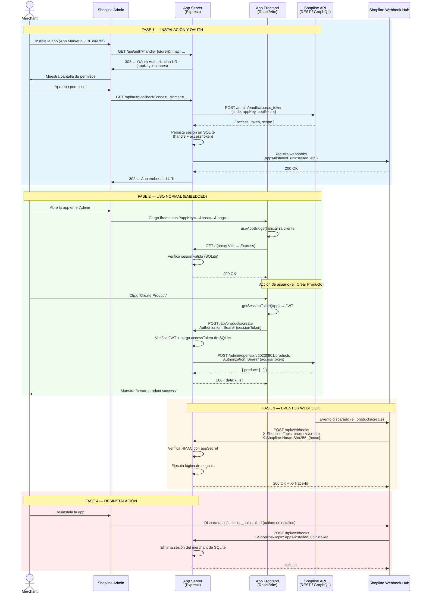

# Shopline App — Diagrama de Interacción

## Ciclo de Vida Completo (Instalación → Uso → Desinstalación)



---

## Diagrama de Componentes (Arquitectura del Template)

```mermaid
graph TB
    subgraph "Shopline Platform"
        ADMIN[Admin UI]
        OAUTH[OAuth 2.0 Service]
        RESTAPI["Admin REST API<br/>v20230901+"]
        WHHUB[Webhook Hub]
    end

    subgraph "App (Monorepo)"
        subgraph "web/ — Frontend (React + Vite)"
            APPBRIDGE["useAppBridge<br/>@shoplinedev/appbridge"]
            AUTHFETCH[useAuthenticatedFetch]
            PAGES[Pages / Router]
        end
        subgraph "app/ — Backend (Express + TS)"
            AUTHROUTE["/api/auth + /callback"]
            WEBHOOKROUTE[/api/webhooks]
            PRODUCTROUTE[/api/products/create]
            SQLITE[("SQLite<br/>Sessions")]
            SHOPLINESD["@shoplineos/shopline-app-express"]
        end
    end

    ADMIN -->|iframe embed| APPBRIDGE
    APPBRIDGE --> AUTHFETCH
    PAGES --> AUTHFETCH
    AUTHFETCH -->|"Bearer sessionToken"| PRODUCTROUTE
    AUTHROUTE --> SHOPLINESD
    SHOPLINESD --> OAUTH
    OAUTH -->|access_token| SHOPLINESD
    SHOPLINESD --> SQLITE
    PRODUCTROUTE -->|"Bearer access_token"| RESTAPI
    WHHUB -->|"POST HMAC-verified"| WEBHOOKROUTE
    WEBHOOKROUTE --> SQLITE
```

---

## Notas sobre el Flujo de Tokens

| Token | Quién lo emite | Quién lo consume | Vida útil |
|---|---|---|---|
| **OAuth `code`** | Shopline OAuth Service | Backend `/api/auth/callback` | Un solo uso |
| **`access_token`** | Shopline OAuth Service | Backend → Admin REST API | Largo plazo (persiste en SQLite) |
| **Session JWT** | `@shoplinedev/appbridge` (cliente) | Backend como Bearer header | Corto plazo (~1 min); se renueva automáticamente |
